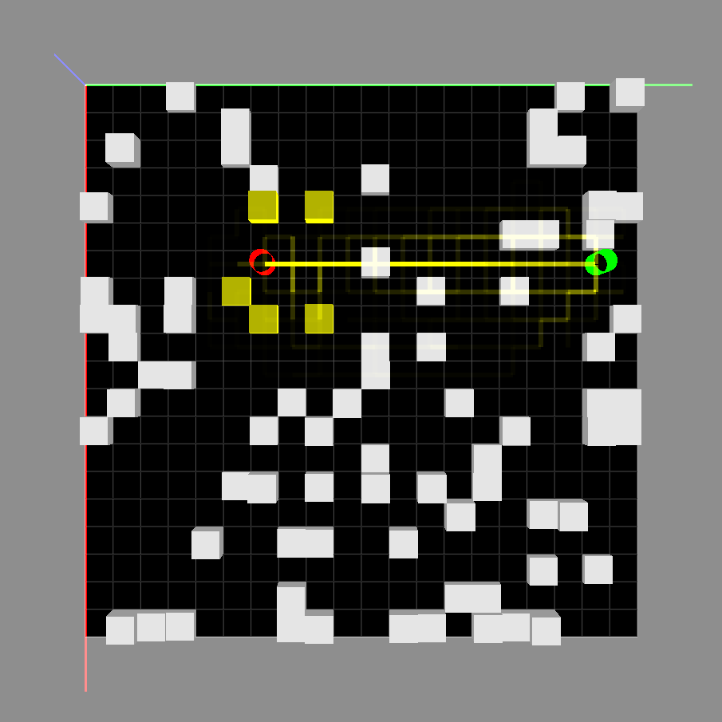
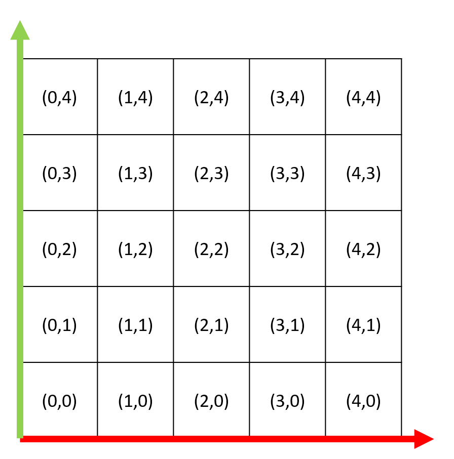

# robot100: Stanford AA228/CS238 Final Project
This reposity creates a 3D visualization tool for Monte Carlo Tree Search implmented for an agent (red) moving towards an assigned goal location (green). It can only sense obstacles (white) within a specified sensor range. It depicts the individual tree paths in yellow.

  <em>The agent (red) going towards goal (green). Obstacles are yellow if the agent can currently detect them or white if the agent cannot currently detect them. Monte Carlo Search Tree paths are shown in yellow</em>
 

## Abstract
A mobile agent, such as a parts-carrying robot on a factory floor, a rover on an extraterrestrial surface or even a cleaning robot in an office building, often finds itself in an environment that it must navigate, moving to a designated target area in order to perform or complete a task. The agent is usually familiar with the general map characteristics of the environment in which it moves, but it may need to avoid small, local obstacles that have been placed in its path. In addition, the fact that the agent's next assigned goal location is unpredictable forces the agent to use online path planning to reach its goal. Our hero (the agent) must be able to use its sensors, assigned goal location, and set of possible actions to dodge the obstacles in the environment and reach the assigned goal location unimpeded. Here we show that Monte Carlo Tree Search can be implemented in order to reliably direct the agent to the assigned goal location.

## Setup
Install needed dependencies:  
`pip3 install PyQt5 pyqtgraph numpy`

## Execution
`python3 main.py`

## Option
To see all available execution options, run `python3 main.py -h`

Some typical parameters:

Size of gridworld (20x20 (default): -s (int) (int)

Percentage of spots are obstacles (0.1 (default)): -o (float)

Method: -m (0: monte carlo (default), 1: direct, 2: random)

## Problem Variables

  <em>indexing into the grid worlds</em>
 

  <em>The agent (red) going towards goal (green). In this example, the robot has a vision depth of 2 and can only see the obstacles within the yellow dashed boundary</em>
 

 ## Resetting
 The problem can be reset with `Ctrl + C` in the terminal and running the code again.
